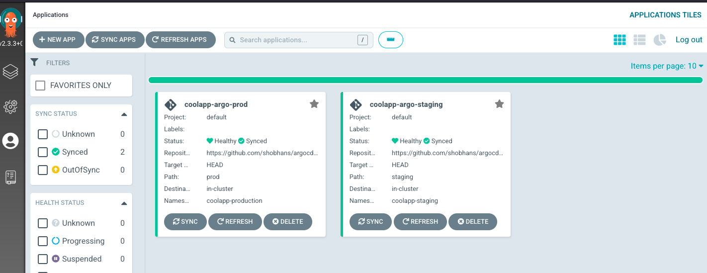
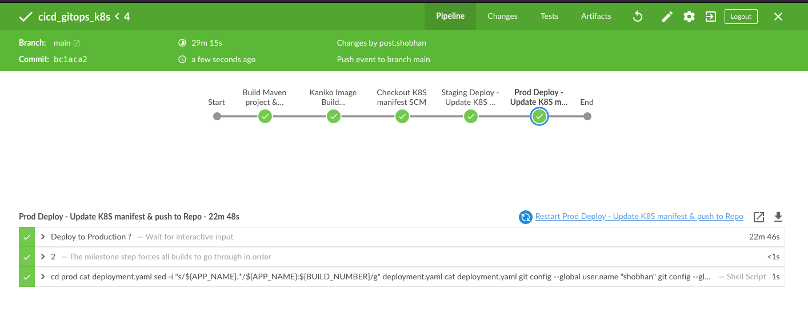
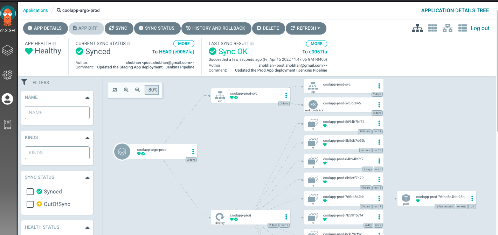

# CICD using GitOps with ArgoCD, Jenkins, Kubernetes, SpringBoot web application

CI part is achieved using Jenkins and for CD, ArgoCD is being used to deploy the Kubernetes manifests for SpringBoot application on Staging(coolapp-staging) and Production (coolapp-production) namespaces.

This repo contains only K8S manifests for argocd app, which is updated using Jenkins pipeline. ArgoCD monitors this repo and creates/updates resources(deployment, service) on K8S. Services are using NodePort on this demo. To visit the running application after a successful deploy, visit the following link:

- http://{type-node-ip-address}:30083 (staging)
- http://{type-node-ip-address}:30082 (prod)

### Github repo for Jenkins pipeline and SpringBoot webapp

https://github.com/shobhans/cicd_gitops_k8s.git

## Create ArgoCD Application on K8S

```bash

kubectl apply -f prod-application.yaml
kubectl apply -f staging-application.yaml

```



### Links

- Install Jenkins on K8S using helm - https://github.com/shobhans/jenkins-using-helm-on-k8s
- Getting started with ArgoCD - https://argo-cd.readthedocs.io/en/stable/getting_started/
- Create SpringBoot App - https://start.spring.io/

### Screenshots



